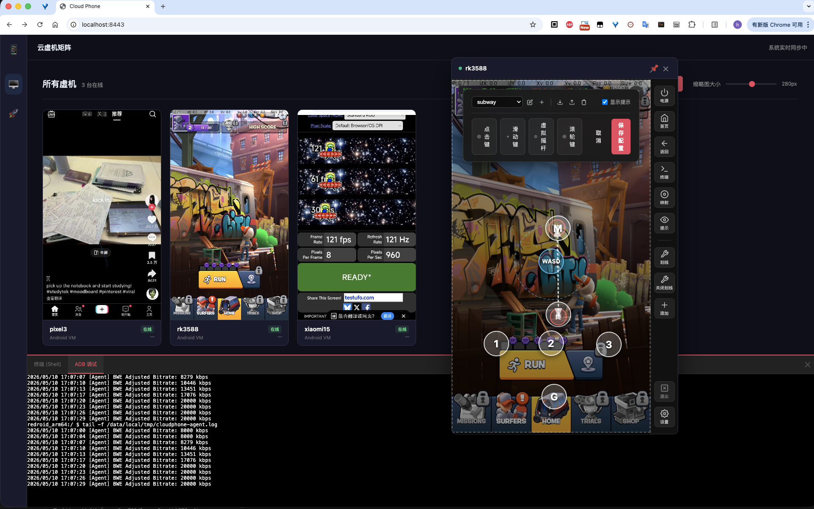
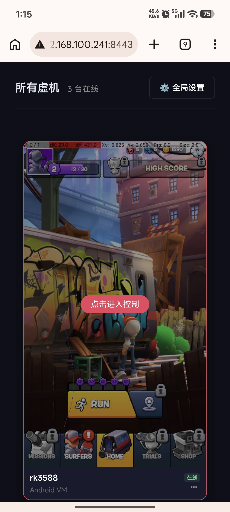

# Scrcpy over WebRTC (CloudPhone)

中文 | [English](README.en.md)

📖 **官方技术文档与保姆级部署指南**：👉 [https://cloudphone-official.hqw700.workers.dev/docs/](https://cloudphone-official.hqw700.workers.dev/docs/)

基于 WebRTC 和 Scrcpy 的高性能、低延迟云手机解决方案，无需客户端，可以通过网页直接连接。
采用 **Fat Agent (直连模式)** 架构，结合 **硬件级 PTS 透传** 技术，实现媲美原生 Scrcpy 的丝滑体验。

<p align="center">
  
  
</p>

## 1. 核心特性

- **极致流畅**: 采用零扫描流解析 (Zero-Search Parsing)，不引入新的内存拷贝，性能和原生scrcpy基本一致。
- **公网增强**: 原生支持 IPv6 直连，彻底绕过运营商 CGNAT 封锁，显著提升移动网络下的打洞成功率。
- **全能交互**: 支持多指触控、物理按键模拟、自定义映射（键盘按键映射到屏幕）、WebADB 终端、实时高频快照。
- **动态控制**: 支持在连接前或连接后通过 UI 面板动态修改设备分辨率、码率、帧率以及开启/关闭 BWE 动态码率。
- **一键部署**: 支持 WebUSB/WebADB 浏览器直连物理设备部署，无需本地安装 ADB 环境。
- **网页直连**: 支持所有终端（IOS/Android/Win/Mac/Linux）通过浏览器连接。
- **支持群控**: 支持高同步率群控, 从控机器支持高帧率预览。
- **摆脱ADB**: 支持以root权限运行

## 2. 快速开始
```bash
  docker pull buutuu/scrcpy-over-webrtc:latest
```

### 🔑 默认连接地址与账户凭证
服务拉起成功后，在同局域网的电脑/手机浏览器中即可打开管理仪表盘大盘：
* **访问地址**：`https://<您的宿主机IP>:8443` (信令与 Web 默认以 HTTPS 模式运行)
* **默认管理员账号**：`admin`
* **默认管理员密码**：`admin123`

### 2.1 Host 网络模式 (推荐)
如果您的 Linux 宿主机有独立的公网 IP 或是纯内网环境，且没有端口占用冲突，**首选 Host 模式**。

*   **启动命令**:
    ```bash
    docker run -d \
      --name cp-aio \
      --net=host \
      -e PUBLIC_IP=<宿主机真实IP> \
      buutuu/scrcpy-over-webrtc:latest
    ```
*   **优势**: 容器直接使用宿主机网络，零 NAT 转发损耗，无需映射大量 UDP 端口段，网络吞吐量最高。
*   **注意**: 必须确保宿主机上 `3478`（TURN）和 `8443`（信令）等端口未被其他服务占用。
*   **PUBLIC_IP**: 当有公网IP时填入公网IP，当局域网内使用内填入宿主机IP

---

### 2.2 NAT / Bridge 网络模式 (常规)
如果运行在 macOS、Windows 等 Docker 虚拟化环境，或者出于安全考量必须使用 `-p` 映射端口，请务必遵循以下两条策略，**切忌映射整个 `49152-65535` 端口段（会导致宿主机 OOM 崩溃）**。

#### 策略 A：收窄 TURN UDP 端口段映射
在配置中指定一个极窄的中转 UDP 端口区间（如 100 个），并只放行此范围。

*   **启动命令 (常规对称映射)**:
    ```bash
    docker run -d --name cp-aio \
      -p 8443:8443 \
      -p 3478:3478/tcp \
      -p 3478:3478/udp \
      -p 55000-55100:55000-55100/udp \
      -e PUBLIC_IP=<宿主机物理IP> \
      -e COTURN_MIN_PORT=55000 \
      -e COTURN_MAX_PORT=55100 \
      buutuu/scrcpy-over-webrtc:latest
    ```

#### 策略 B：非对称端口映射（重点）
当宿主机的默认端口（如 8443、3478）被其他服务占用，导致您不得不将外部端口映射为非对称端口（如 8443 映射为 18443，3478 映射为 13478）时。

> [!WARNING]
> 如果直接启动，容器内部的信令服务由于不知道外部映射了什么端口，依然会将默认的 `3478` 作为 TURN 地址下发给前端。导致前端网页尝试连接 `宿主机:3478` 失败而黑屏。
> 
> **解决方案**：必须传入 `EXTERNAL_SIGNALING_PORT` 和 `EXTERNAL_TURN_PORT` 环境变量，明确告知容器外部映射的公开端口。

*   **启动命令 (非对称端口映射)**:
    ```bash
    docker run -d --name cp-aio \
      -p 18443:8443 \
      -p 13478:3478/tcp \
      -p 13478:3478/udp \
      -p 55000-55100:55000-55100/udp \
      -e PUBLIC_IP=192.168.100.242 \
      -e COTURN_MIN_PORT=55000 \
      -e COTURN_MAX_PORT=55100 \
      -e EXTERNAL_SIGNALING_PORT=18443 \
      -e EXTERNAL_TURN_PORT=13478 \
      buutuu/scrcpy-over-webrtc:latest
    ```

*   **PUBLIC_IP**: 当有公网IP时填入公网IP，当局域网内使用内填入宿主机IP

### 2.3 数据持久化与容器挂载 (推荐，升级不丢数据)
为了方便容器的重建与更新，信令服务器将所有的物理持久化资产（包含用户账户 `users.json`、设备分组标签 `device_tags.json`、用户上传的文件 `downloads/`、虚机预览截图 `snapshots/`）一站式归集到了统一的 `data/` 目录中。

在 Docker 部署时，建议将宿主机的物理目录挂载到容器内的 `/app/data` 目录：

*   **Host 模式挂载运行**:
    ```bash
    docker run -d \
      --name cp-aio \
      --net=host \
      -e PUBLIC_IP=<宿主机真实IP> \
      -v ./data:/app/data \
      buutuu/scrcpy-over-webrtc:latest
    ```
*   **常规模式挂载运行**:
    ```bash
    docker run -d --name cp-aio \
      -p 8443:8443 \
      -p 3478:3478/tcp \
      -p 3478:3478/udp \
      -p 55000-55100:55000-55100/udp \
      -v ./data:/app/data \
      -e PUBLIC_IP=<宿主机物理IP> \
      -e COTURN_MIN_PORT=55000 \
      -e COTURN_MAX_PORT=55100 \
      buutuu/scrcpy-over-webrtc:latest
    ```
*   **挂载效果**：拉取最新的镜像并重建容器进行版本升级时，您的用户数据和上传资源都**不会被覆盖或丢失**。


## 3. 部署 Android Agent (入网)

容器拉起后，一切连接入口都将通过容器日志清晰打印。运行以下命令查看接入说明：
```bash
docker logs cp-aio
```

### 3.1 一键脚本部署 (首选推荐)
1. 访问网页管理后台，进入 **“部署新设备”** 页面。
2. 页面上提供统一的 **“一键部署资源包 (`agent-deploy.zip`)”** 下载。下载并解压在您的电脑端。
3. 将物理手机使用 USB 线连接电脑，开启 **「USB 调试」**。
4. 在电脑终端进入解压后的一键包目录，执行由页面动态生成的如下一键脚本指令：
   * **Linux / macOS**: `chmod +x run.sh && ./run.sh -id <自定义设备ID> -signaling ws://<宿主机IP>:8443`
   * **Windows CMD**: `run.bat -id <自定义设备ID> -signaling ws://<宿主机IP>:8443`

---

## 4. 前端二次开发指引 ( Development )

前端源码位于 `web-app` 目录下，完全开源。我们提供 **“本地前端 + 官方 Docker AIO 容器后端”** 的极速混合开发模式，无需在本地配置繁琐的 Go 编译环境即可实时热更新开发。

1. **准备后端**：参考前文启动官方 AIO 容器。
2. **安装前端依赖**：
   ```bash
   cd web-app
   npm install
   ```
3. **本地开发与实时热更新**：
   通过指定后端的 IP 地址启动开发服务器（Vite 的代理会将所有的 API 和 WebSocket 连接自动转发给容器）：
   ```bash
   # 如果后端跑在本地
   VITE_PROXY_TARGET=http://localhost:8443 npm run dev
   ```
4. **编译构建**：
   ```bash
   npm run build
   ```
   打包产物默认输出至根目录的 `assets/` 目录下。

> 💡 详细的前端目录结构、开发参数调优和 Docker 挂载联调说明，请直接查阅文档：[docs/DEVELOPMENT.md](docs/DEVELOPMENT.md)。

> [!IMPORTANT]
> **发布介质说明**：
> 本开源仓库仅托管前端 `web-app` 的全部源码。如果您需要以及免 Docker 的原生物理服务器部署版本和免服务器部署版本（全部运行在Android手机内），请直接前往 [releases](https://github.com/hqw700/ScrcpyOverWebRTC/releases) 页面下载官方打包好的完整发布包。

## License

**MIT License** - 前端 `web-app` 目录源代码开源。

*注意：官方 Docker 镜像内的二进制核心组件仅供学习和个人测试使用。*